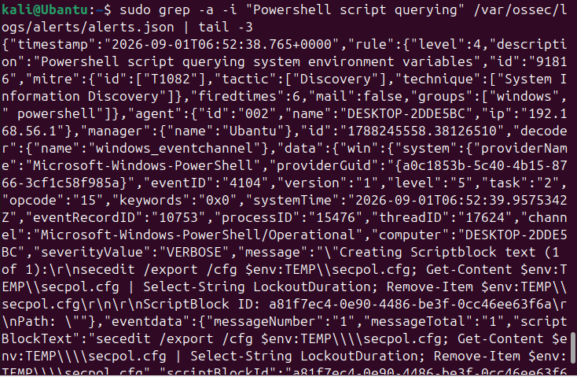

# 🔐 Suspicious PowerShell Activity Analysis Using Wazuh

## 📌 Project Overview

This project demonstrates a **SOC L1 investigation of suspicious PowerShell activity on a Windows endpoint using Wazuh, Windows Event Viewer, PowerShell Script Block Logging, and Sysmon**.

The investigation focuses on PowerShell execution, Script Block Logging, system and security-policy discovery activity, process-level telemetry, and file deletion behavior.

The objective was to determine whether the observed PowerShell activity was **benign, suspicious, or indicative of confirmed malicious activity** based on the available evidence.

---

# 🖥️ Lab Environment

| Component           | Details                        |
| ------------------- | ------------------------------ |
| Security Platform   | Wazuh                          |
| Windows Endpoint    | `DESKTOP-2DDE5BC`              |
| Wazuh Agent         | `002`                          |
| Operating System    | Windows                        |
| Log Sources         | PowerShell Operational, Sysmon |
| PowerShell Event ID | `4104`                         |
| Investigation Type  | SOC L1 Alert Investigation     |

---

# 🎯 Investigation Objective

The objectives of this investigation were to:

* Identify suspicious PowerShell activity
* Analyze PowerShell Script Block Logging
* Investigate Windows Event ID `4104`
* Correlate PowerShell activity with Sysmon process telemetry
* Analyze the executed commands and scripts
* Investigate system and security-policy discovery activity
* Review file deletion behavior
* Build an event timeline
* Map relevant activity to MITRE ATT&CK
* Determine severity and analyst verdict
* Recommend appropriate response actions

---

# 🚨 1. Alert

Wazuh generated an alert related to PowerShell activity that queried information from the Windows environment.

### Alert Details

| Field        | Details                                            |
| ------------ | -------------------------------------------------- |
| Alert Source | Wazuh                                              |
| Rule ID      | `91816`                                            |
| Activity     | PowerShell querying system/environment information |
| MITRE ATT&CK | `T1082 – System Information Discovery`             |
| Endpoint     | `DESKTOP-2DDE5BC`                                  |

The alert was treated as a **security investigation trigger**, not as automatic proof of malicious activity.

### Evidence



---

# 🔎 2. Evidence

## Evidence 1 — Wazuh PowerShell Alert

Wazuh identified PowerShell activity associated with system/environment information discovery.

**Rule ID:** `91816`

**MITRE ATT&CK:** `T1082 – System Information Discovery`

This alert provided the initial trigger for investigation.

---

## Evidence 2 — PowerShell Script Block Logging

Windows Event Viewer recorded PowerShell **Event ID 4104**, which provides visibility into PowerShell script content when Script Block Logging is enabled.

One observed script was:

```powershell
secedit /export /cfg $env:TEMP\secpol.cfg
Get-Content $env:TEMP\secpol.cfg |
Select-String LockoutDuration
Remove-Item $env:TEMP\secpol.cfg
```

Additional security-policy values observed during the investigation included:

```text
ResetLockoutCount
LockoutBadCount
LockoutDuration
MinimumPasswordLength
MinimumPasswordAge
```

The script exported local security-policy information to a temporary configuration file, read selected values, and then removed the temporary file.

### Evidence


---

## Evidence 3 — PowerShell Script Block Event

The Windows Event Viewer confirmed PowerShell Script Block Logging events under:

```text
Microsoft-Windows-PowerShell/Operational
```

with:

```text
Event ID: 4104
```

This confirms that PowerShell Script Block Logging was enabled and that the endpoint was capturing executed PowerShell script content.

### Evidence


---

## Evidence 4 — Sysmon Process Creation

Sysmon provided process-level telemetry related to PowerShell execution.

The PowerShell executable observed during the investigation was:

```text
C:\Windows\System32\WindowsPowerShell\v1.0\powershell.exe
```

Process creation telemetry can provide additional investigative context such as:

* Process ID
* Parent process
* User
* Command line
* Execution time

This information can help determine how PowerShell was launched and whether the execution chain was unusual.

### Evidence


---

## Evidence 5 — PowerShell File Deletion

Wazuh generated an alert related to PowerShell being used to delete a file or directory.

**Rule ID:** `92021`

**Description:** PowerShell was used to delete files or directories.

The observed command included:

```powershell
Remove-Item
```

The command removed the temporary security-policy configuration file after the script had read the required information.

File deletion is **not automatically malicious**. However, deletion activity is relevant during an investigation because attackers can also use PowerShell to remove artifacts.

### Evidence


---

# 🧪 3. Investigation Steps

The investigation followed a structured SOC L1 workflow.

### Step 1 — Alert Triage

The Wazuh alert was reviewed to identify:

* Affected endpoint
* Rule ID
* Detection description
* Associated MITRE ATT&CK technique

### Step 2 — PowerShell Script Analysis

Event ID `4104` was reviewed to determine the actual PowerShell commands executed.

The investigation identified commands related to:

* Security-policy configuration
* Lockout settings
* Password-policy settings
* Temporary file creation
* Temporary file deletion

### Step 3 — Process Investigation

Sysmon process creation telemetry was reviewed to identify:

* PowerShell executable
* Process ID
* Parent process
* User
* Command line
* Execution time

### Step 4 — Cross-Source Correlation

Evidence from:

```text
Wazuh
+
Windows Event Viewer
+
PowerShell Event ID 4104
+
Sysmon
```

was correlated to understand the activity from multiple perspectives.

### Step 5 — File Activity Analysis

The use of `Remove-Item` was investigated to determine whether the deleted file was a malicious artifact or a temporary file created as part of the observed script.

The evidence indicated that the deleted file was the temporary security-policy configuration file created by the script itself.

### Step 6 — Contextual Assessment

The observed commands were reviewed in context rather than being classified as malicious solely because PowerShell was used.

---

# ⏱️ 4. Investigation Timeline

The investigation sequence was reconstructed as follows:

```text
PowerShell execution
        ↓
Sysmon process creation telemetry
        ↓
PowerShell Script Block Logging
        ↓
Event ID 4104 captures script content
        ↓
Security-policy information queried
        ↓
Wazuh processes the activity
        ↓
Wazuh generates detection alerts
        ↓
Temporary security-policy file removed
        ↓
Analyst reviews and correlates evidence
```

### Timeline Evidence


---

# 🛡️ 5. MITRE ATT&CK Mapping

## T1059.001 — PowerShell

PowerShell was used to execute commands and scripts on the Windows endpoint.

**Tactic:** Execution

---

## T1082 — System Information Discovery

Wazuh identified activity associated with querying information from the Windows environment.

**Tactic:** Discovery

**Wazuh Rule:** `91816`

---

## T1070.004 — File Deletion

The investigation evaluated file deletion because `Remove-Item` was used to remove the temporary configuration file.

**Tactic:** Defense Evasion

**Wazuh Rule:** `92021`

> **Assessment:** The presence of file deletion alone does not confirm defense evasion. The deleted file appeared to be a temporary configuration file generated by the investigated script.

---

# 🚦 6. Severity Assessment

### Severity: Medium / Suspicious

The activity was considered worthy of investigation because:

* PowerShell was used to execute scripts.
* Security-policy information was queried.
* Wazuh generated multiple related detections.
* PowerShell was used to remove a temporary file.

However, the available evidence did **not** establish confirmed malicious intent.

---

# 🧑‍💻 7. Analyst Verdict

> **Verdict: Suspicious activity requiring further investigation**

The investigation confirmed PowerShell execution and identified Script Block Logging events containing security-policy queries and temporary file deletion.

The observed `secedit`, `Get-Content`, `Select-String`, and `Remove-Item` commands can be used for legitimate administrative or security-assessment purposes.

Therefore, the activity should **not be classified as confirmed malicious based on the available evidence alone**.

Additional contextual evidence such as the initiating user, parent process, complete command line, network connections, and related endpoint activity should be reviewed before assigning a confirmed malicious verdict.

---

# 💡 8. Recommended Actions

## Detection

* Enable PowerShell Script Block Logging.
* Monitor PowerShell Event ID `4104`.
* Monitor Sysmon process creation events.
* Correlate PowerShell activity with user and parent-process information.
* Monitor suspicious PowerShell execution from unexpected parent processes.
* Detect encoded or obfuscated PowerShell commands.
* Monitor unusual PowerShell activity initiated by Office applications, browsers, scheduled tasks, or other unexpected processes.
* Monitor repeated use of PowerShell file-management commands such as `Remove-Item` in suspicious contexts.

## Response

If additional evidence confirms malicious activity:

1. Identify the affected user and endpoint.
2. Review the complete PowerShell command line.
3. Investigate the parent and child process chain.
4. Review network connections associated with the process.
5. Search for persistence mechanisms.
6. Search for related activity from the same user, host, or process.
7. Isolate the endpoint when active compromise is suspected.
8. Preserve relevant logs and forensic evidence.

---

# 📊 9. Key Findings

| Finding                      | Evidence                                    |
| ---------------------------- | ------------------------------------------- |
| PowerShell Execution         | Sysmon Process Creation                     |
| Script Block Logging         | PowerShell Event ID `4104`                  |
| System/Environment Discovery | Wazuh Rule `91816`                          |
| Security-Policy Queries      | Event ID `4104`                             |
| File Deletion                | Wazuh Rule `92021`                          |
| PowerShell Technique         | T1059.001                                   |
| System Information Discovery | T1082                                       |
| File Deletion                | T1070.004                                   |
| Final Assessment             | Suspicious / Requires Further Investigation |

---

# 📸 10. Investigation Evidence

All screenshots are stored in the [`screenshots`](./screenshots/) directory.

### Evidence 1 — Wazuh PowerShell Alert


### Evidence 2 — PowerShell Event ID 4104


### Evidence 3 — PowerShell Script Block Event


### Evidence 4 — Sysmon Process Creation


### Evidence 5 — PowerShell File Deletion


### Evidence 6 — PowerShell Timeline


---

# 🧠 Skills Demonstrated

* Wazuh Alert Investigation
* PowerShell Security Monitoring
* Windows Event Log Analysis
* PowerShell Script Block Logging
* Event ID `4104` Analysis
* Sysmon Process Investigation
* Process and Command-Line Analysis
* Security-Policy Activity Analysis
* File Activity Investigation
* Alert Correlation
* Timeline Analysis
* MITRE ATT&CK Mapping
* SOC L1 Alert Triage
* Evidence-Based Classification
* Incident Response Recommendations

---

# 📝 Conclusion

This project demonstrates a **SOC L1 investigation of PowerShell activity using Wazuh and Windows endpoint telemetry**.

The investigation correlated Wazuh alerts, PowerShell Event ID `4104`, Windows Event Viewer, and Sysmon telemetry to understand the observed activity.

The investigation identified PowerShell commands that queried local security-policy information and removed a temporary configuration file.

Although these behaviors can be associated with attacker activity, the available evidence did not provide sufficient proof of malicious intent.

The final assessment was therefore:

> **Suspicious activity requiring further contextual investigation, but not confirmed malicious based on the available evidence.**

This investigation demonstrates the importance of **correlating multiple telemetry sources and using evidence-based analysis instead of classifying PowerShell activity as malicious solely because PowerShell was used.**
