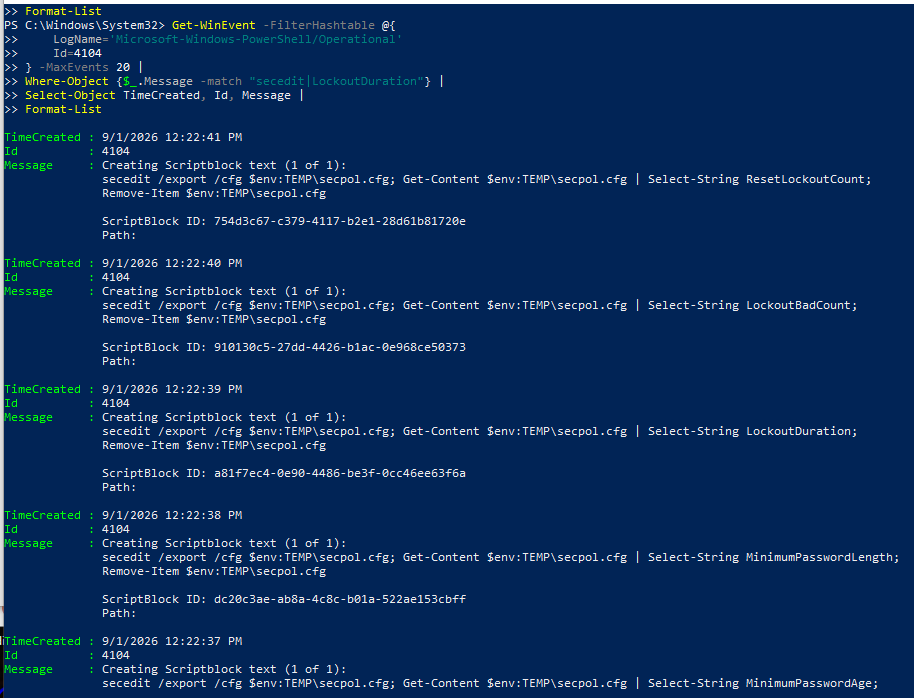
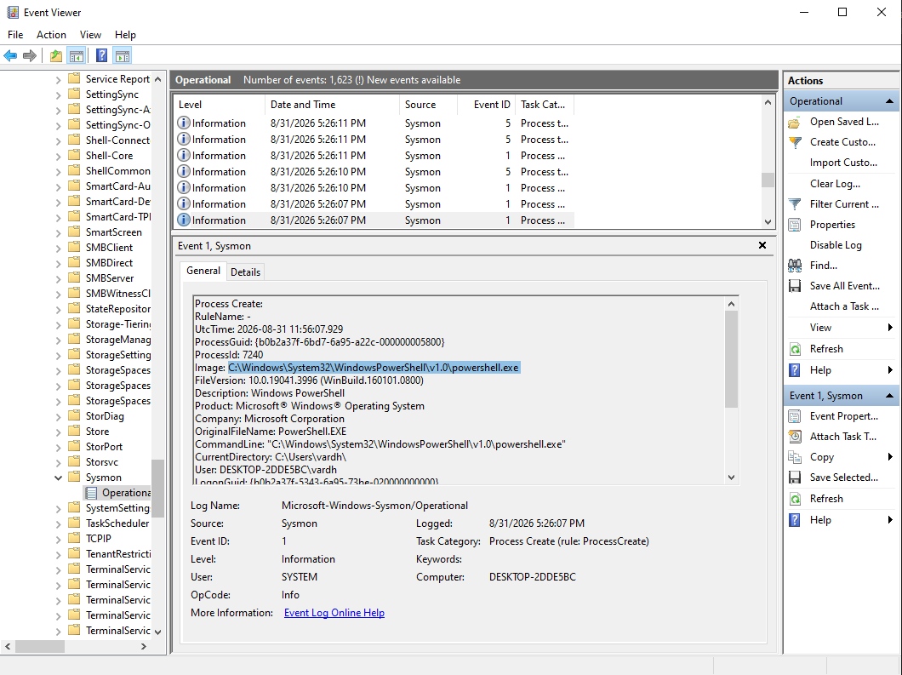
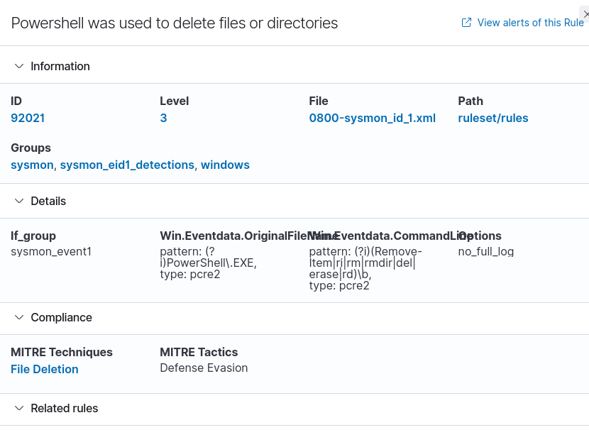

# 🔐 Suspicious PowerShell Activity Analysis Using Wazuh

## 📌 Project Overview

This project demonstrates a **SOC L1 investigation of suspicious PowerShell activity on a Windows endpoint using Wazuh, Windows Event Viewer, PowerShell Script Block Logging, and Sysmon**.

The investigation focuses on PowerShell execution, Script Block Logging, system and security-policy discovery activity, process-level telemetry, and file deletion behavior.

The objective was to determine whether the observed activity was **benign, suspicious, or indicative of confirmed malicious activity** based on the available evidence.

---

# 🖥️ Lab Environment

| Component           | Details                        |
| ------------------- | ------------------------------ |
| Security Platform   | Wazuh                          |
| Windows Endpoint    | `DESKTOP-2DDE5BC`              |
| Wazuh Agent         | `002`                          |
| Operating System    | Windows                        |
| Log Sources         | PowerShell Operational, Sysmon |
| PowerShell Event ID | `4104`                         |
| Investigation Type  | SOC L1 Alert Investigation     |

---

# 🎯 Investigation Objectives

The objectives of this investigation were to:

* Identify PowerShell activity that warranted investigation
* Analyze PowerShell Script Block Logging
* Investigate Windows Event ID `4104`
* Correlate PowerShell activity with Sysmon process telemetry
* Analyze executed commands and scripts
* Investigate security-policy and system information discovery activity
* Review PowerShell file deletion behavior
* Correlate multiple telemetry sources
* Map observed behavior to MITRE ATT&CK
* Determine severity and analyst verdict
* Recommend appropriate detection and response actions

---

# 🚨 1. Alert

Wazuh generated an alert related to PowerShell activity associated with system and environment information discovery.

## Alert Details

| Field        | Details                                            |
| ------------ | -------------------------------------------------- |
| Alert Source | Wazuh                                              |
| Rule ID      | `91816`                                            |
| Activity     | PowerShell querying system/environment information |
| MITRE ATT&CK | `T1082 – System Information Discovery`             |
| Endpoint     | `DESKTOP-2DDE5BC`                                  |

The alert was treated as an **investigation trigger**, not as automatic proof of malicious activity.

### Alert Evidence


---

# 🔎 2. Evidence

## Evidence 1 — PowerShell Event ID 4104

Windows Event Viewer recorded PowerShell **Event ID 4104**, providing visibility into the PowerShell script content that was executed.

One observed script contained:

```powershell
secedit /export /cfg $env:TEMP\secpol.cfg
Get-Content $env:TEMP\secpol.cfg |
Select-String LockoutDuration
Remove-Item $env:TEMP\secpol.cfg
```

Additional security-policy values observed during the investigation included:

```text
ResetLockoutCount
LockoutBadCount
LockoutDuration
MinimumPasswordLength
MinimumPasswordAge
```

The script exported local security-policy information to a temporary configuration file, read selected values, and then removed the temporary file.

### Evidence



---

## Evidence 2 — PowerShell Script Block Logging

The Windows Event Viewer confirmed PowerShell Script Block Logging under:

```text
Microsoft-Windows-PowerShell/Operational
```

with:

```text
Event ID: 4104
```

This confirms that PowerShell Script Block Logging was enabled and that PowerShell script content was being captured on the endpoint.

### Evidence


---

## Evidence 3 — Sysmon Process Creation

Sysmon provided process-level visibility into PowerShell execution.

The observed PowerShell executable was:

```text
C:\Windows\System32\WindowsPowerShell\v1.0\powershell.exe
```

Process creation telemetry can provide important investigative context such as:

* Process ID
* Parent process
* User
* Command line
* Execution time

This information can help determine how PowerShell was launched and whether the execution chain was unusual.

### Evidence



---

## Evidence 4 — PowerShell File Deletion

Wazuh generated an alert related to PowerShell being used to delete a file or directory.

### Alert Details

| Field            | Details                                        |
| ---------------- | ---------------------------------------------- |
| Rule ID          | `92021`                                        |
| Activity         | PowerShell used to delete files or directories |
| Observed Command | `Remove-Item`                                  |

The observed script removed the temporary security-policy configuration file after reading the required information.

File deletion is **not automatically malicious**. However, it is relevant during a security investigation because attackers can also use deletion commands to remove artifacts.

### Evidence



---

# 🧪 3. Investigation Steps

The investigation followed a structured SOC L1 workflow.

## Step 1 — Alert Triage

The Wazuh alert was reviewed to identify:

* Affected endpoint
* Rule ID
* Alert description
* Associated MITRE ATT&CK technique

The initial alert was treated as a detection requiring investigation rather than immediately classified as malicious.

---

## Step 2 — PowerShell Script Analysis

PowerShell Event ID `4104` was reviewed to identify the actual commands executed.

The investigation identified activity involving:

* Security-policy information
* Account lockout settings
* Password-policy settings
* Temporary configuration file creation
* Temporary file deletion

---

## Step 3 — Process Investigation

Sysmon process creation telemetry was reviewed to identify:

* PowerShell executable
* Process ID
* Parent process
* User
* Command line
* Execution time

This provided additional context around the PowerShell execution.

---

## Step 4 — Cross-Source Correlation

The following telemetry sources were correlated:

```text
Wazuh
   +
Windows Event Viewer
   +
PowerShell Event ID 4104
   +
Sysmon
```

Correlation across multiple sources was used to understand the activity instead of relying on a single alert.

---

## Step 5 — File Activity Analysis

The use of:

```powershell
Remove-Item
```

was investigated.

The available evidence indicated that the file being removed was the temporary security-policy configuration file created by the investigated script.

Therefore, the deletion itself was **not sufficient evidence to conclude malicious artifact removal**.

---

## Step 6 — Contextual Assessment

The PowerShell commands were evaluated in context.

The investigation considered whether the observed activity could be explained by:

* Legitimate administration
* Security assessment activity
* System configuration checks
* Malicious discovery activity

The presence of PowerShell alone was not treated as proof of malicious behavior.

---

# 🛡️ 4. MITRE ATT&CK Mapping

## T1059.001 — PowerShell

PowerShell was used to execute commands and scripts on the Windows endpoint.

**Tactic:** Execution

---

## T1082 — System Information Discovery

Wazuh detected PowerShell activity associated with querying system/environment information.

**Tactic:** Discovery

**Wazuh Rule:** `91816`

---

## T1070.004 — File Deletion

The investigation identified the use of `Remove-Item` to delete a temporary configuration file.

**Tactic:** Defense Evasion

**Wazuh Rule:** `92021`

> **Assessment:** File deletion alone does not confirm defense evasion. In this investigation, the deleted file appeared to be a temporary configuration file created by the script itself.

---

# 🚦 5. Severity Assessment

### Severity: **Medium — Suspicious**

The activity warranted investigation because:

* PowerShell was used to execute commands.
* Security-policy information was queried.
* Wazuh generated related detections.
* PowerShell was used to remove a temporary file.

However, the available evidence did **not** establish confirmed malicious intent.

Therefore, the alert was assessed as:

> **Medium severity / Suspicious activity requiring further investigation**

---

# 🧑‍💻 6. Analyst Verdict

> **Verdict: Suspicious activity requiring further investigation**

The investigation confirmed PowerShell execution and identified Script Block Logging events containing security-policy queries and temporary file deletion.

The observed commands:

```text
secedit
Get-Content
Select-String
Remove-Item
```

can be used for legitimate administrative or security-assessment purposes.

The available evidence did not provide sufficient proof of malicious intent.

Therefore, the activity was classified as **suspicious rather than confirmed malicious**.

Further context such as the initiating user, parent process, complete command line, network activity, and related endpoint events should be reviewed before assigning a confirmed malicious verdict.

---

# 💡 7. Recommended Actions

## Detection

* Enable PowerShell Script Block Logging.
* Monitor PowerShell Event ID `4104`.
* Monitor Sysmon process creation events.
* Correlate PowerShell activity with user and parent-process information.
* Monitor suspicious PowerShell execution from unexpected parent processes.
* Detect encoded or obfuscated PowerShell activity.
* Monitor PowerShell launched by Office applications, browsers, scheduled tasks, and other unusual parent processes.
* Investigate suspicious use of PowerShell file-management commands such as `Remove-Item`.

## Response

If additional evidence confirms malicious activity:

1. Identify the affected endpoint and user.
2. Review the complete PowerShell command line.
3. Investigate the parent and child process chain.
4. Review related network connections.
5. Search for persistence mechanisms.
6. Search for related activity from the same host or user.
7. Isolate the endpoint if active compromise is suspected.
8. Preserve relevant logs and forensic evidence.

---

# 📊 8. Key Findings

| Finding                      | Evidence                                    |
| ---------------------------- | ------------------------------------------- |
| PowerShell Execution         | Sysmon Process Creation                     |
| Script Block Logging         | PowerShell Event ID `4104`                  |
| System Information Discovery | Wazuh Rule `91816`                          |
| Security-Policy Queries      | PowerShell Event ID `4104`                  |
| File Deletion Activity       | Wazuh Rule `92021`                          |
| PowerShell                   | T1059.001                                   |
| System Information Discovery | T1082                                       |
| File Deletion                | T1070.004                                   |
| Final Assessment             | Suspicious / Requires Further Investigation |

---

# 📸 9. Investigation Evidence

All screenshots are stored in the [`screenshots`](./screenshots/) directory.

### 1. Wazuh PowerShell Alert


---

### 2. PowerShell Event ID 4104


---

### 3. PowerShell Script Block Event


---

### 4. Sysmon Process Creation


---

### 5. PowerShell File Deletion


---

# 🧠 Skills Demonstrated

* Wazuh Alert Investigation
* PowerShell Security Monitoring
* Windows Event Log Analysis
* PowerShell Script Block Logging
* Event ID `4104` Analysis
* Sysmon Process Investigation
* Process and Command-Line Analysis
* Security-Policy Activity Analysis
* File Activity Investigation
* Cross-Source Correlation
* Alert Triage
* Timeline/Sequence Analysis
* MITRE ATT&CK Mapping
* Evidence-Based Classification
* SOC L1 Investigation Methodology
* Incident Response Recommendations

---

# 📝 Conclusion

This project demonstrates a **SOC L1 investigation of suspicious PowerShell activity using Wazuh and Windows endpoint telemetry**.

The investigation correlated Wazuh alerts, PowerShell Event ID `4104`, Windows Event Viewer, and Sysmon process telemetry to understand the observed activity.

The investigation identified PowerShell commands that queried local security-policy information and removed a temporary configuration file.

Although these behaviors can appear in attacker activity, they can also occur during legitimate administrative or security-assessment operations.

Based on the available evidence, the activity was classified as:

> **Suspicious and requiring further investigation, but not confirmed malicious.**

This project demonstrates the importance of **alert triage, evidence collection, cross-source correlation, MITRE ATT&CK mapping, and evidence-based analyst conclusions** rather than treating every PowerShell event as malicious.
